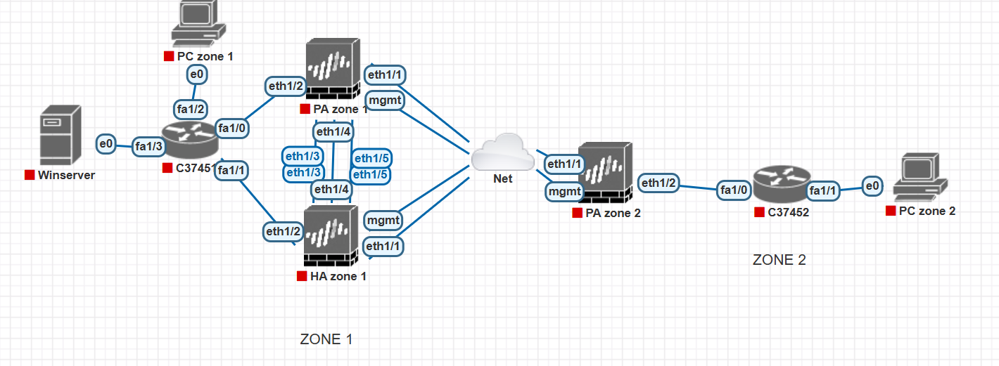

1. Network Topology & Infrastructure 
Multi-Zone Architecture: Designed a robust network spanning two geographical zones (Zone 1 & Zone 2) connected via a simulated ISP (Net cloud).
High Availability (HA) Cluster: Deployed a Palo Alto HA Active/Active cluster in Zone 1 to ensure 24/7 business continuity and eliminate single points of failure.
Integrated Endpoints: Integrated Windows Server (Active Directory/LDAP) and multiple workstations (PC Zone 1 & 2) for authenticating traffic and testing security policies.

2. Core Security Implementations 
Next-Generation Firewall (NGFW) Features:
App-ID & URL Filtering: Implemented granular control to identify applications (e.g., YouTube) and block specific URL categories (e.g., vnexpress.net) regardless of port or protocol.
SSL Decryption: Configured Forward Proxy decryption to inspect encrypted HTTPS traffic, a critical step for modern threat prevention and Data Filtering (DLP).
Content-ID & WildFire: Leveraged Signature-based IPS, Anti-Malware (DNS Sinkhole), and WildFire Sandboxing to protect against Zero-day exploits and C2 communications.
Secure Connectivity:
Site-to-Site IPsec VPN: Established a secure, route-based tunnel between zones using Transit Subnets and Static Routing for inter-office communication.
GlobalProtect (Remote Access): Deployed a scalable VPN solution using an Authentication Sequence (LDAP + Local Database) to support both AD and local administrative users.
Network & NAT Management: Managed complex NAT scenarios, including SNAT (PAT) for internet access, Static NAT (1-1) for server publishing, and Destination NAT for specific port forwarding.

3. Advanced Administration & Monitoring
User-ID Integration: Orchestrated User Mapping via Active Directory and Captive Portal (Web-form) to enforce security policies based on user identity instead of just IP addresses.
Zone Protection & DoS Mitigation: Hardened the "Untrust" (WAN) interface with Zone Protection profiles, including SYN Cookies and flood thresholds, to defend against volumetric attacks.
Operational Forensics: Utilized "ground-truth" data from Traffic, Threat, and URL Filtering logs to perform incident analysis and optimize the overall security posture.
